# Portfolio Optimization Dashboard

A Streamlit dashboard for **Modern Portfolio Theory** analysis. Load asset price data (ETFs, crypto, indices), visualize the efficient frontier, run Monte Carlo simulations, and evaluate risk via VaR and CVaR.

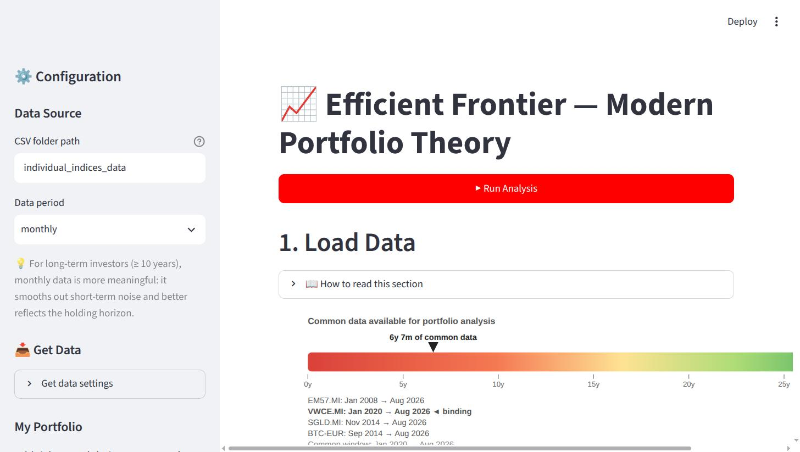

*Section 1 — Load Data: the data-availability gauge showing each asset's span and the shared window the portfolio sections are built on.*

## Features

- **Input portfolio analysis** — your allocation held at a **selectable rebalancing cadence** (buy-and-hold by default): allocation pie, cumulative-return chart with per-asset overlays, annotated underwater curve, deepest-drawdown recovery and longest-underwater-stretch durations, headline growth/drawdown metrics (geometric CAGR, annualised return/volatility, Sharpe, Sortino, max drawdown), and a **Tail Risk & Return Distribution** subsection (parametric + historical VaR/CVaR, mean/median/vol/skew/kurtosis, distribution histogram)
- **Selectable rebalancing frequency** — choose how often your portfolio resets to target weights (Never / Every 6 months / Yearly / Every period). Governs the Input Portfolio section (§6, including its tail-risk subsection), which follows your cadence; the efficient-frontier sections stay per-period (the basis MPT optimization requires). Each affected section states its rebalancing basis up top
- **Efficient Frontier** — Monte Carlo simulation (uniform-simplex sampling) and SciPy optimization (SLSQP); each highlighted portfolio's card shows both its arithmetic (optimizer-input) and compound (CAGR) return alongside volatility, Sharpe, Sortino, Max Drawdown and CVaR
- **Risk metrics** — Sharpe & Sortino ratios, Max Drawdown, and both parametric (normal) and historical VaR/CVaR with fat-tail (skew/kurtosis) diagnostics
- **Per-asset analytics** — CAGR, simple/calendar-year returns, look-back-period metrics (only windows that fully fit each asset's history) and cumulative-return charts, each computed over the asset's **own full history** (not the shorter window all the assets share)
- **Simple returns throughout** — one consistent return definition (actual realised % change) across every section and all optimization, so there's no return-type toggle to reason about
- **Real (inflation-adjusted) terms** *(optional)* — a sidebar toggle deflates the performance sections (§2 Per-Asset Analytics and §6 Input Portfolio, including its tail risk) by an assumed constant annual inflation rate you set, so figures read in today's purchasing power. A constant rate lowers CAGR/average returns and deepens drawdowns, but **leaves volatility, correlations and the efficient-frontier weights unchanged** (the real risk premium is inflation-invariant) — so the §7/§8 optimization sections stay nominal and say so
- **After-tax / net-liquidation** *(optional)* — set a capital-gains tax rate in the sidebar (0% = off) to add an after-tax net-liquidation line to §6: the rate is charged on **net** realized gains at each rebalance (losses net against gains within the rebalance; no carry-forward), plus the tax still owed on unrealized gains if you liquidated today. The chart shows the tax drag versus the pre-tax line, and rebalancing more often realizes gains sooner and widens it
- **Rolling returns** — **cumulative** 1/2/3/5/7/10-year moving-window returns (whole-window totals, *not* annualised, so windows of different lengths aren't directly comparable) for individual assets (the portfolio's rolling returns live in the Input Portfolio Analysis section)
- **Built-in guidance** — every section has a "How to read this section" panel with plain-language explanations and formulas
- **Data download** — built-in yfinance downloader with progress streaming, **auto-converting non-EUR tickers to EUR** so the whole portfolio shares one currency (toggleable)
- **Total-return reconstruction** — extend a short-lived accumulating ETF backward with the longer **price-return** index it tracks: the missing dividend yield is calibrated from the ETF overlap, the older history is grossed up and spliced on, and reconstructed rows are flagged in section 1
- **Data-quality checks** — section 1 reports any **recorded stock splits** (read straight from yfinance's `stock splits` column — informational, since Adj Close is already split-adjusted) and flags **statistically anomalous price moves** with a robust, self-calibrating outlier test that adapts per asset and per interval (so genuine crypto swings aren't false-flagged)
- **Currency safety** — section 1 warns if any loaded series isn't in EUR (the app otherwise assumes a single base currency)
- **Mixed-calendar caveat** — when a basket mixes 7-day (crypto) with ~5-day (equity) assets, the shared-date join leaves covariance/correlation (and the frontier/VaR built on them) approximate; the app flags this in section 1 and again wherever those figures are used (§5–§8), and suggests weekly/monthly data
- **Flexible inputs** — configurable portfolio weights, rebalancing frequency, real-vs-nominal terms (with assumed inflation rate), confidence level, date filter

## Screenshots

Every section, in order. Section 1 is the gauge in the image above.

**2 — Per-Asset Analytics.** Each asset over its *own* full history, so a long-history holding isn't
truncated to the shortest one. Look-back windows that don't fit the asset's life are omitted rather
than silently mislabelled, and a true `Full (6y 7m)` row closes the table.

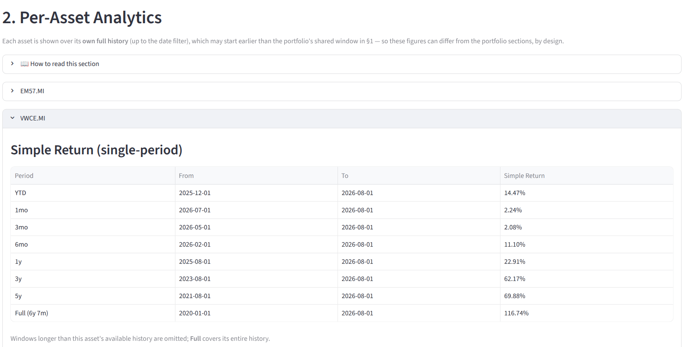

**3 — Per-Asset Prices.** Raw and normalized (base = 1000) closing prices over the shared window.

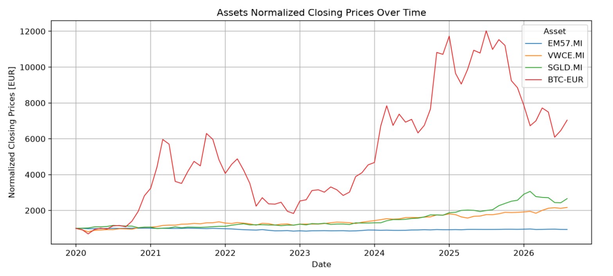

**4 — Per-Asset Rolling Returns.** Moving-window *cumulative* returns — the whole-window total, not
annualised, which is why windows of different lengths aren't directly comparable.

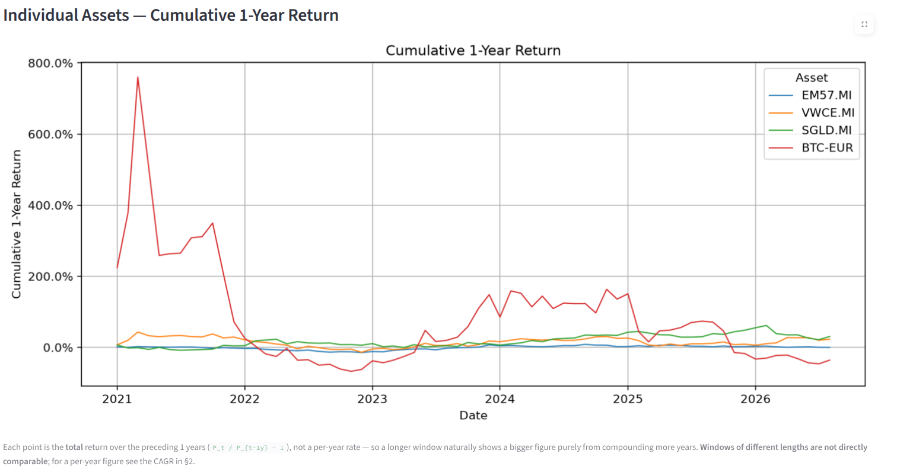

**5 — Per-Asset Returns & Statistics.** Per-period min/max/mean/median/std per asset; the gap between
mean and median reads as skew.

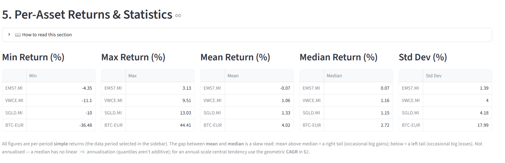

**6 — Input Portfolio Analysis.** Your allocation at the selected rebalancing cadence: cumulative
return with per-asset overlays, then the underwater curve with the deepest drawdown episode shaded.

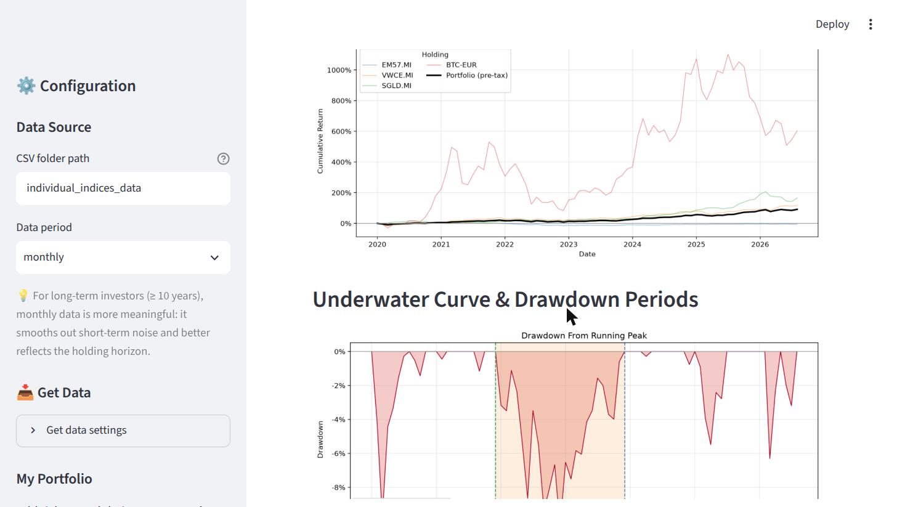

**6 — Tail Risk & Return Distribution.** The realised return distribution against a fitted normal,
with the parametric VaR cut marked, above the mean/median/volatility/skew/kurtosis profile.

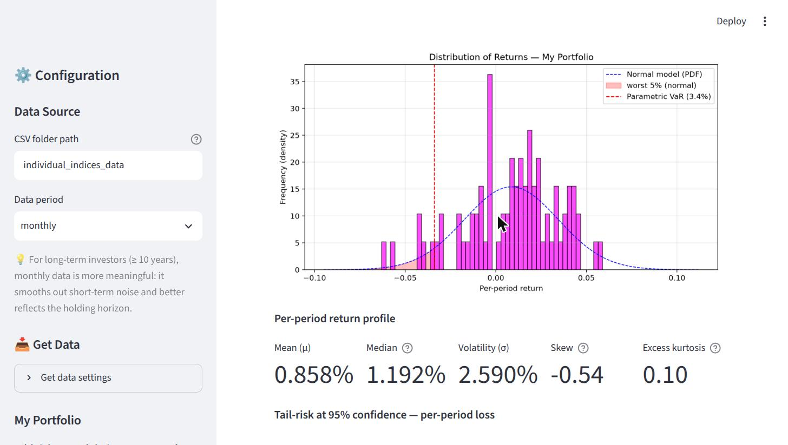

**7 — Monte Carlo Efficient Frontier.** Random portfolios sampled uniformly on the simplex, coloured
by Sharpe ratio, with your portfolio and each optimized portfolio marked.

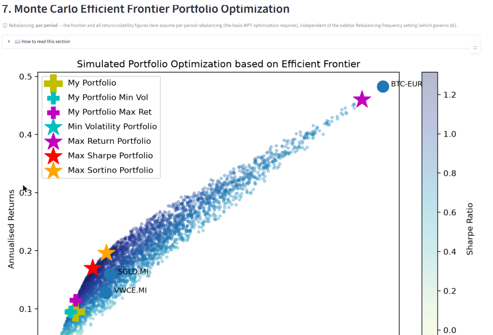

**8 — Scipy Efficient Frontier.** The same cloud with the SLSQP frontier solved on top.

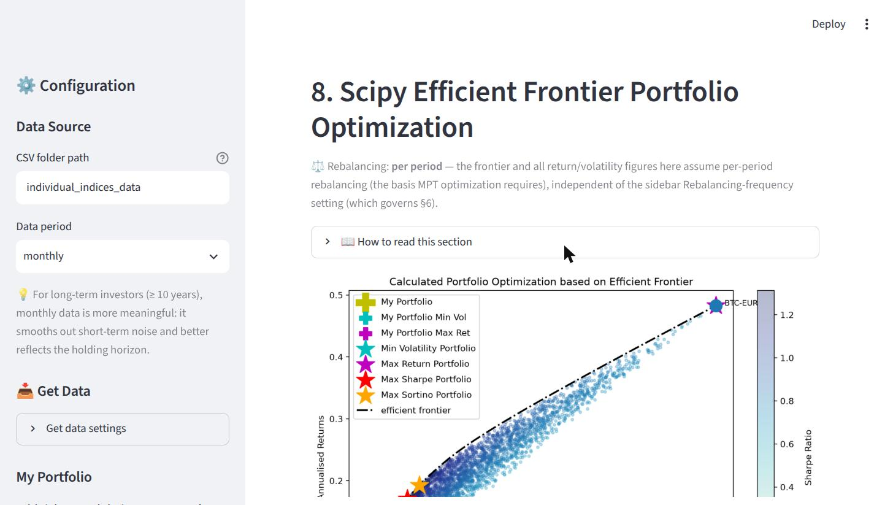

### Getting data in

**Get Data.** One sidebar panel for both jobs — download as is, or download and extend. Both fetch
from Yahoo, so nothing has to be on disk first. Ticker fields are never pre-filled; the greyed
examples are placeholders you don't have to erase.

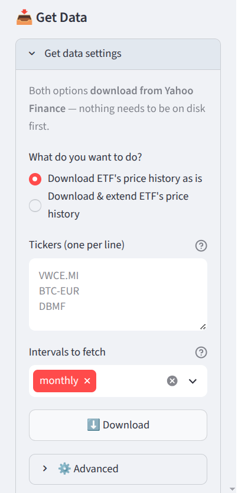

**The guided extend wizard.** Step 1 probes the fund against Yahoo and reports its currency, span and
income treatment before letting you continue.

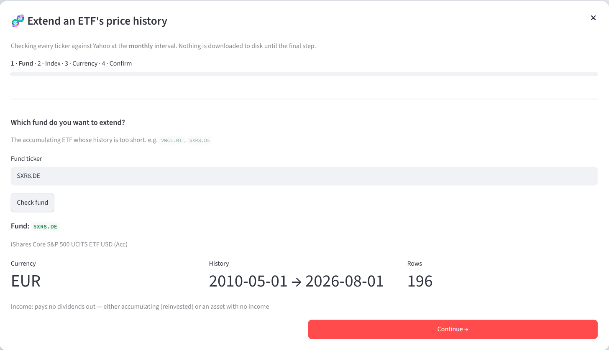

Step 2 is where the pairing is actually judged. Every candidate — curated hint or search result — is
probed for real history *and* fitted against your fund, so you can see up front that `^GSPC` recovers
a plausible **+0.25%/yr** while `SWPPX` recovers **-1.51%/yr** and is flagged implausible. Candidates
that start *after* the fund are demoted with the reason, since they have no earlier history to add.

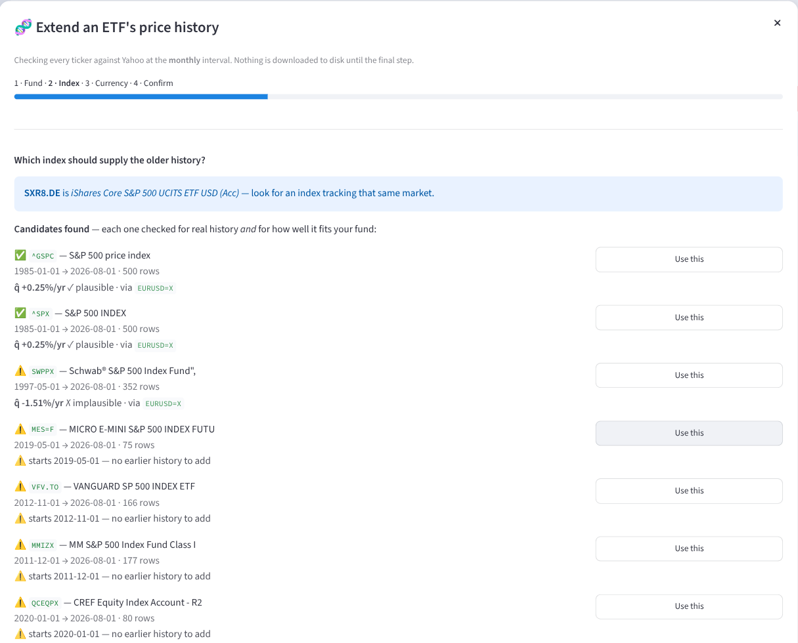

## Setup

Commands below are **Linux/macOS**. On Windows, swap `.venv/bin/…` for `.venv\Scripts\…` — see
**[WINDOWS.md](WINDOWS.md)**, which also covers the corporate-SSL workarounds.

```bash
python3 -m venv .venv
.venv/bin/pip install streamlit pandas numpy scipy matplotlib seaborn yfinance playwright
.venv/bin/playwright install chromium      # ~115 MB, only needed to run the e2e test
```

> **Debian/Ubuntu ship `ensurepip` separately**, so a bare `python3 -m venv .venv` fails with
> `ModuleNotFoundError: No module named 'ensurepip'`. Either `sudo apt install python3-venv`, or build
> it pip-less and bootstrap: `python3 -m venv --without-pip .venv`, then
> `curl -sS https://bootstrap.pypa.io/get-pip.py | .venv/bin/python -`.

> **Requires Streamlit ≥ 1.50.** The app uses APIs from recent Streamlit (`width="stretch"`, and `st.markdown(..., unsafe_allow_html=True)` for the SVG data-availability gauge in place of the now-removed `st.components.v1.html`). Last verified end-to-end on Python 3.14.4 · streamlit 1.62 · pandas 3.0.5 · numpy 2.5.2 · scipy 1.18 · yfinance 1.6 · playwright 1.62.

## Usage

1. **Run analysis** — pre-loaded CSVs for EM57.MI, VWCE.MI, SGLD.MI, IMIE.MI, DBMF, BTC-EUR and ZPRV.DE (daily + monthly) are included in `individual_indices_data/`. Configure your portfolio and parameters in the sidebar, then click **Run Analysis**.

2. **Add or refresh tickers** — expand **📥 Get Data** in the sidebar and pick *Download ETF's price history as is*, then enter tickers in yfinance format (e.g. `IWDA.AS`, `BTC-EUR`) one per line and click Download. Nothing needs to be on disk first. Non-EUR tickers are auto-converted to EUR by default; tick **Keep native currency** under ⚙️ Advanced to store raw prices instead.

3. **Extend an ETF with index history** *(optional)* — in the same panel, pick *Download & extend ETF's price history* and click **🧬 Start guided setup**. A four-step wizard (Fund → Index → Currency → Confirm) probes each ticker against Yahoo before anything runs: it suggests index candidates, previews the recovered yield for each, and derives the FX pair for you. The result is saved as `{ETF}_EXT`; add it to your portfolio to analyze the extended history.

   The index must track the **same underlying** as the ETF, and the recovered yield q̂ is what proves it. The plausible range depends on the pairing, so the wizard judges against two bands: **0–6%/yr** when the index is price-only and the fund collects the dividends (the gap *is* the yield), or **−0.5% to +0.5%/yr** when the index already carries the income or the asset has none, like gold (only fees separate them). Outside its band, **Reconstruct** stays disabled.

4. **View in real terms** *(optional)* — tick **Show real (inflation-adjusted) returns** in the sidebar; an **Assumed annual inflation (%)** field appears beneath it (default 2%) for you to set. The Per-Asset Analytics and Input Portfolio sections then report in today's purchasing power.

5. **Model capital-gains tax** *(optional)* — set **Capital-gains tax on realized gains (%)** in the sidebar (default 0% = off; e.g. Italy ≈ 26%). The Input Portfolio section adds an after-tax net-liquidation line and reports the resulting tax drag.

```bash
.venv/bin/streamlit run efficient_frontier_app/efficient_frontier_app.py
```

## Testing

A Playwright end-to-end test drives the full dashboard in a real browser. Start the app first, then run:

```bash
HEADLESS=1 .venv/bin/python tests/test_dashboard.py
```

This clicks **Run Analysis**, waits for all computations to finish, verifies all 8 section headers, checks portfolio cards, and saves screenshots to `test_screenshots/`.

`HEADLESS=1` is effectively mandatory on Linux — a visible browser needs an X/Wayland display and
hangs without one.

Eight unit tests run standalone (no app, no network) and live in `tests/`. Run one with
`.venv/bin/python tests/test_X.py`, or all of them:

```bash
for t in tests/test_*.py; do [ "$t" = tests/test_dashboard.py ] || .venv/bin/python "$t"; done
```

| Test | Covers |
|---|---|
| `test_total_return_synthesis.py` | Total-return reconstruction and EUR-conversion logic (plus one live check that skips offline) |
| `test_rebalancing.py` | The rebalanced-portfolio value series — the basis for §6, including its tail-risk subsection |
| `test_aftertax.py` | The after-tax / net-liquidation overlay: 0% no-op, monotonicity, single-asset, within-period loss-netting |
| `test_real_terms.py` | The inflation deflator behind the real-terms toggle |
| `test_lookback_windows.py` | The §2 per-asset look-back machinery: window selection, own-history loader, simple-return/CAGR guards |
| `test_geometric_return.py` | The compound-CAGR figure on the portfolio cards |
| `test_extend_wizard.py` | The guided wizard's pure helpers: FX-pair direction, index-name cleanup, and the two-band q̂ gate |
| `test_optimizers.py` | The §7/§8 SLSQP frontier solvers: long-only simplex, volatility floor, exact target hits |

## Project Structure

```
efficient_frontier_app/
├── efficient_frontier_app.py   # Entry point — sidebar, orchestration
├── portfolio_calculations.py   # Pure math: optimization, Monte Carlo, VaR/CVaR
├── data_handling.py            # CSV loading, merging, return computation
├── ui_components.py            # Section renderers (8 sections)
└── descriptions.py             # Per-section "How to read this section" guides

individual_indices_data/        # Asset price CSVs (pre-loaded samples included; downloader writes here)
tests/                          # Playwright e2e (test_dashboard.py) + standalone unit tests
docs/images/                    # README screenshots
```

## Data Format

CSVs must be named `{ticker}_data_{period}.csv` (e.g. `IWDA.AS_data_daily.csv`) with columns `date` and `adj close`. The built-in downloader produces this format automatically.

Downloaded files also carry a `currency` column, and reconstructed `{ticker}_EXT_data_{period}.csv` files add `synthetic` / `recon_yield` columns marking the reconstructed history. These extra columns are optional metadata — readers only need `date` and `adj close`.

## Dashboard Sections

| # | Section | Description |
|---|---------|-------------|
| 1 | Load Data | Recorded stock-split report, price-anomaly detection, data availability gauge, non-EUR currency warning, reconstructed-history flag |
| 2 | Per-Asset Analytics | CAGR, returns, drawdown over each asset's own full history (optionally in real, inflation-adjusted terms) |
| 3 | Per-Asset Prices | Raw and normalized price charts |
| 4 | Per-Asset Rolling Returns | Cumulative moving-window returns (1/2/3/5/7/10y, not annualised) for individual assets |
| 5 | Per-Asset Returns & Statistics | Per-asset min/max/mean/median/std, Sortino, covariance/correlation matrices, return distributions |
| 6 | Input Portfolio Analysis | Your allocation at the selected rebalancing cadence (buy-and-hold by default), optionally in real (inflation-adjusted) terms and/or with an after-tax net-liquidation overlay: allocation pie, cumulative returns, annotated underwater curve, drawdown/recovery durations, headline growth metrics (geometric CAGR, arithmetic avg annual return, volatility, Sharpe, Sortino, max drawdown), correlation heatmap, and a **Tail Risk & Return Distribution** subsection (parametric & historical VaR/CVaR, mean/median/vol/skew/kurtosis, distribution histogram) |
| 7 | Monte Carlo Efficient Frontier Portfolio Optimization | Random portfolio simulation (Sharpe & Sortino) — per-period rebalancing |
| 8 | Scipy Efficient Frontier Portfolio Optimization | Optimized efficient frontier via SLSQP — per-period rebalancing |

## Data-quality checks (section 1)

Section 1 runs two **independent** checks on the raw prices, because a stock split and a bad price are different things:

**Recorded stock splits (📐).** Read directly from yfinance's `stock splits` column — the exact split ratio (e.g. `2.0` = 2-for-1, `0.1` = 1-for-10 reverse) on the exact ex-date, identical across daily/weekly/monthly because it's recorded data, not inferred from a price jump. Since the app analyses **Adj Close**, which yfinance has *already split-adjusted*, a split produces **no jump** in the series and is purely informational. Files without the column (legacy downloads, `_EXT` reconstructions) are simply skipped.

**Price-anomaly check (⚠️).** A fixed "flag any move > 60%" rule can't serve every asset and interval at once — a monthly bar compounds ~21 daily moves, and Bitcoin routinely swings further in a month than an equity asset does in a year. Instead, each step-to-step return is standardised against the asset's *own* history using a fat-tail-resistant robust z-score:

```
z = (r − median(r)) / (1.4826 · MAD(r))
```

where `MAD` is the median absolute deviation. A move is flagged only when `|z| > 8` **and** the move exceeds a 45% floor. The floor sits above the largest genuine single-bar swings (even crypto rarely moves more than ~40% in a day), since real glitches and unadjusted splits move price by roughly half or double. Because the scale adapts per asset and per interval, normal high-volatility swings pass while a fat-finger tick, a currency mix-up, or an unadjusted split stands out.

Each flagged move is cross-referenced against the recorded split dates, shown in the **"On split date?"** column:

- **`yes`** — the anomalous move lands on a recorded split ex-date, so it's almost certainly just a split not reflected in this particular series (harmless).
- **`—`** — the move doesn't coincide with any split; this is the one to investigate as a possible data glitch.
